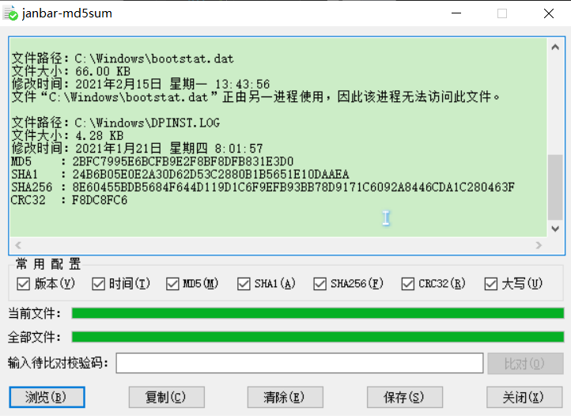

# md5sum

#### 介绍
项目地址：<https://github.com/jan-bar/md5sum>  
软件截图：

前言：  
之所以想做这个软件是因为一直在使用的<http://keir.net/hash.html>软件有很多功能不能满足。  
经过自学C#，研究多线程，异步更新UI，等等知识，终于用C#完成了一个自己使用的md5sum.exe。  
下载：[md5sum_x64.exe](md5sum/md5sum_x64.exe)，[md5sum_x86.exe](md5sum/md5sum_x86.exe)

#### 使用说明

1.  支持拖拽文件到显示框。
2.  支持在界面敲回车打开选择文件框。
3.  支持在已有文本中查找输入的校验码(忽略大小写)。
4.  会记录上次勾选的常用配置和窗口位置,下次启动时生效上次配置。
5.  计算较大文件Hash时支持停止计算打断进行中的任务。
6.  用管理员权限打开cmd,执行`md5sum.exe reg`可以将本程序注册到右键菜单。
7.  用管理员权限打开cmd,执行`md5sum.exe unreg`可以移除右键菜单。
8.  程序单例运行,已有程序运行时再使用命令行、右键菜单等操作仍然是在之前进程中计算。
9.  支持命令行指定计算hash类型。指定所有hash类型都要计算`md5sum.exe all?d:\tmp.txt`。
10.  指定4种hash类型的组合:`md5sum.exe md5?sha1?sha256?crc32?d:\tmp.txt`。
